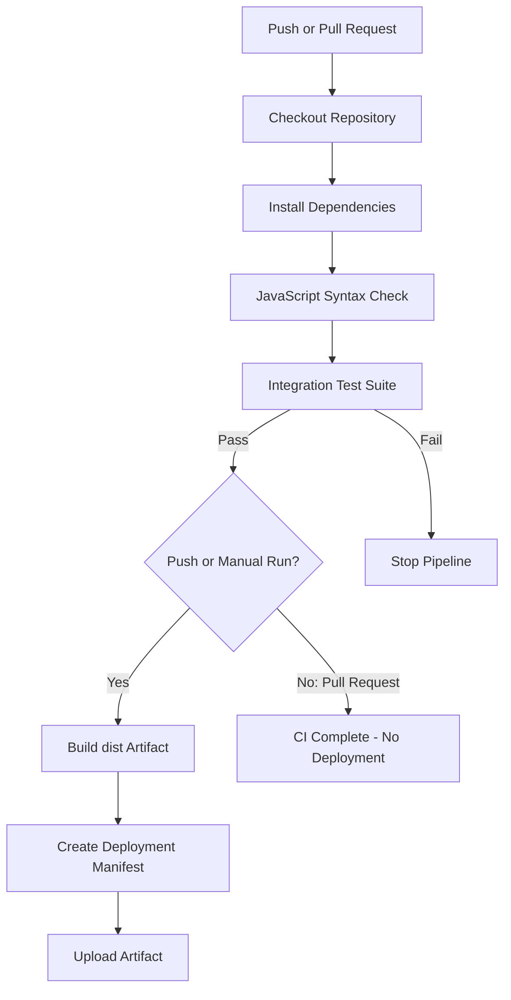

# Pipeline flow

```mermaid
flowchart TD
  A[Push or Pull Request] --> B[Checkout Repository]
  B --> C[Install Dependencies]
  C --> D[JavaScript Syntax Check]
  D --> E[Integration Test Suite]
  E -->|Pass| F{Push or Manual Run?}
  E -->|Fail| G[Stop Pipeline]
  F -->|Yes| H[Build dist Artifact]
  H --> I[Create Deployment Manifest]
  I --> J[Upload Artifact]
  F -->|No: Pull Request| K[CI Complete - No Deployment]
```
